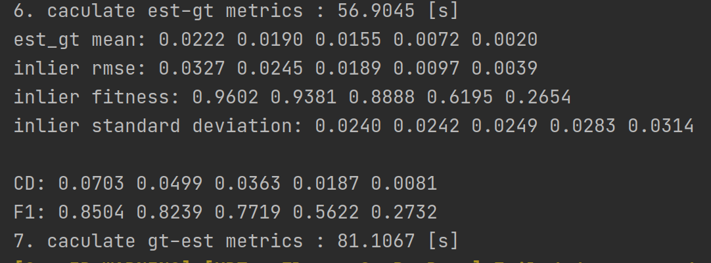
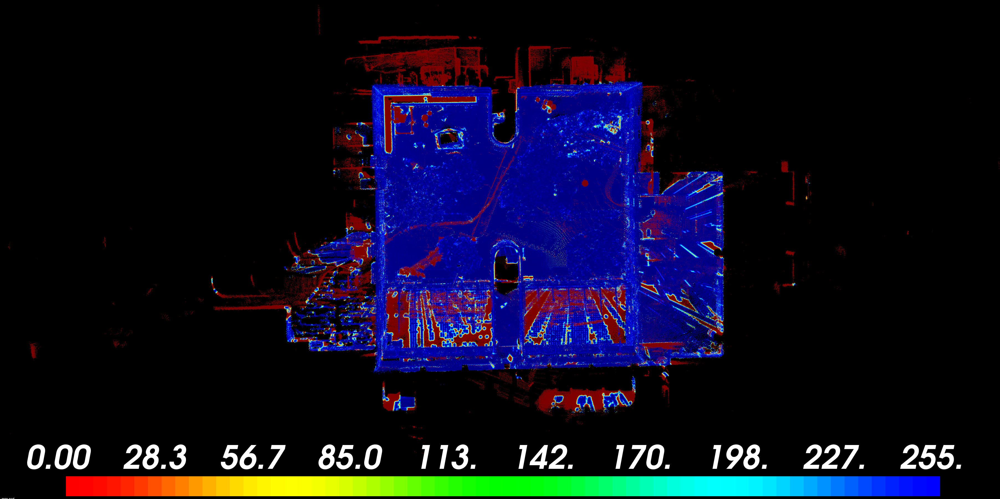

# Cloud_Map_Evaluation
Point cloud map evaluation library  for the FusionPortable dataset.  Metrics include RMSE, Accuracy(mean error), Precision(standard deviation), completeness(overlap ratio), chamfer distance(MD) and F1-score at all levels of 1cm/2cm/5cm/10cm/20cm.

## Publications

We kindly recommond to cite our paper if you find this library useful:

```latex
@article{Jiao2022Aug,
	author = {Jiao, Jianhao and Wei, Hexiang and Hu, Tianshuai and Hu, Xiangcheng and Zhu, Yilong and He, Zhijian and Wu, Jin and Yu, Jingwen and Xie, Xupeng and Huang, Huaiyang and Geng, Ruoyu and Wang, Lujia and Liu, Ming},
	title = {{FusionPortable: A Multi-Sensor Campus-Scene Dataset for Evaluation of Localization and Mapping Accuracy on Diverse Platforms}},
	journaltitle = {ArXiv e-prints},
	shortjournal = {arXiv},
	year = {2022},
	month = aug,
	eprint = {2208.11865},
	doi = {10.48550/arXiv.2208.11865}
}
```

## Dependencies

- *[Open3d 0.16](https://github.com/isl-org/Open3D)* 

 

we have a point cloud map generated by a pose-slam system, and we have a ground truth point cloud map. Then we caculate related metrics.




We can also get a rendered distance-error map in this process, the color R->G->B represent for the distance error at a level of 0-10cm.


