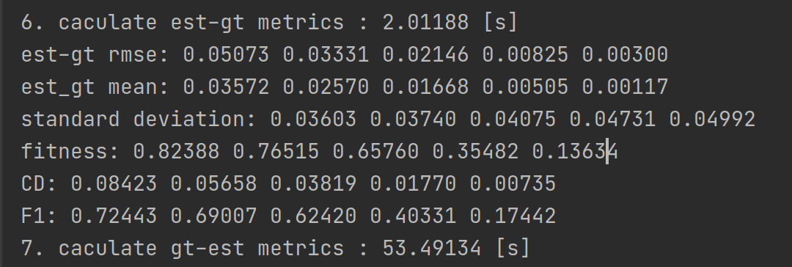
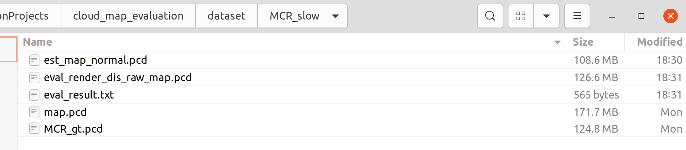
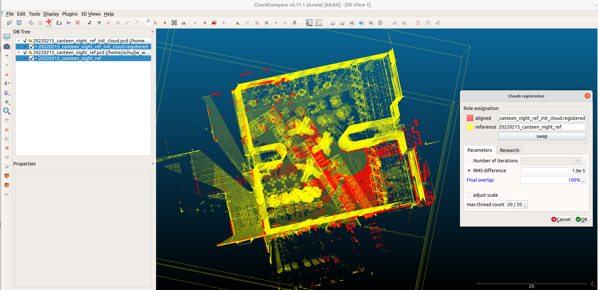

# Cloud Map Evaluation
Point cloud map evaluation library  for the [FusionPortable](https://ram-lab.com/file/site/fusionportable/dataset/fusionportable/) dataset.  The Metrics include RMSE, Accuracy(mean error), Precision(standard deviation), Completeness(overlap ratio), Chamfer distance(CD) and F1-score at all levels of `1/2/5/10/20`.

**Author**: Xiangcheng HU, Jiaojian Hao, Tianshuai HU.

## Dependencies

- *[Open3d ( >= 0.11)](https://github.com/isl-org/Open3D)* 

- Eigen3

## Test Data

| sequence | Test PCD                                                     | GT PCD                                                       |
| -------- | ------------------------------------------------------------ | ------------------------------------------------------------ |
| MCR_slow | [password: 1](https://hkustconnect-my.sharepoint.com/:u:/g/personal/xhubd_connect_ust_hk/ES9eSANEr-9NvkFqMzMFsecBo5r3hBpBnj0c6BMPgsfXnQ?e=aijdPf) | [password: 1](https://hkustconnect-my.sharepoint.com/:u:/g/personal/xhubd_connect_ust_hk/ESfn5EEsiPlCiJcydVc_HqgBDGqy65MHoyu63XE-iKbFBQ?e=dTDon4) |

## Usage

1. install open3d

```bash
git clone https://github.com/isl-org/Open3D.git
cd Open3D && mkdir build && cd build   
cmake ..
make install
```

2. install cloud_map_eval

```bash
git clone https://github.com/JokerJohn/Cloud_Map_Evaluation.git
cd Cloud_Map_Evaluation/cloud_map_eval && mkdir build
cmake ..
./cloud_map_eval
```

3. set some params

```c++
double icp_max_distance = 0.2;             // max correspondence pairs distance for  knn search in icp
int method = 2;                            // 0:point-to-point icp 1:point-to-plane icp 
Vector5d accuacy_level = Vector5d::Zero();   // set evaluatation accucay level, eg. 20cm/10cm/5cm/2cm/1cm
accuacy_level << 0.2, 0.1, 0.05, 0.02, 0.01;  //  do not recommand to change this

Eigen::Matrix4d initial_matrix = Eigen::Matrix4d::Identity();   // initial pose for your map

sequence_name = "MCR_slow";
est_path = "../dataset/MCR_slow/";
gt_path = "../dataset/MCR_slow/MCR_gt.pcd";
results_path = "../dataset/MCR_slow/";
```

4. get the final results

we have a point cloud map generated by a pose-slam system, and we have a ground truth point cloud map. Then we caculate related metrics.



We can also get a rendered raw distance-error map(10cm) and inlier distance-error map(2cm) in this process, the color R->G->B represent for the distance error at a level of 0-10cm.


we can also get a simpe mesh reconstructed from pcd cloud map.


5. we got the result flies.



## TO DO

- add python script to plot the results.

##  

## Publications

We kindly recommond to cite [our paper](https://arxiv.org/abs/2208.11865) if you find this library useful:

```latex
@article{Jiao2022Aug,
	author = {Jiao, Jianhao and Wei, Hexiang and Hu, Tianshuai and Hu, Xiangcheng and Zhu, Yilong and He, Zhijian and Wu, Jin and Yu, Jingwen and Xie, Xupeng and Huang, Huaiyang and Geng, Ruoyu and Wang, Lujia and Liu, Ming},
	title = {{FusionPortable: A Multi-Sensor Campus-Scene Dataset for Evaluation of Localization and Mapping Accuracy on Diverse Platforms}},
	journaltitle = {ArXiv e-prints},
	shortjournal = {arXiv},
	year = {2022},
	month = aug,
	eprint = {2208.11865},
	doi = {10.48550/arXiv.2208.11865}
}
```