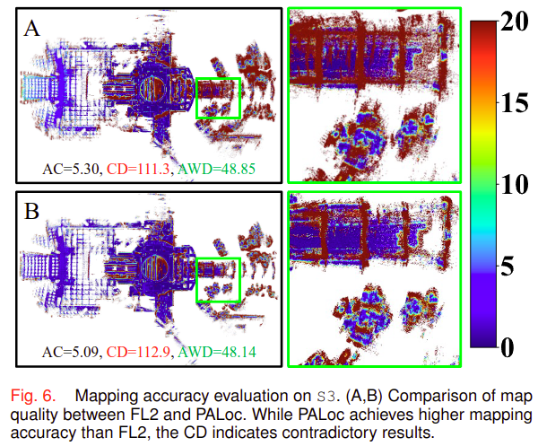
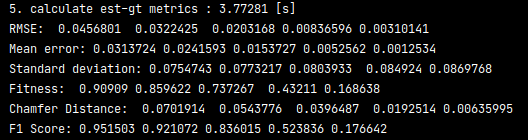
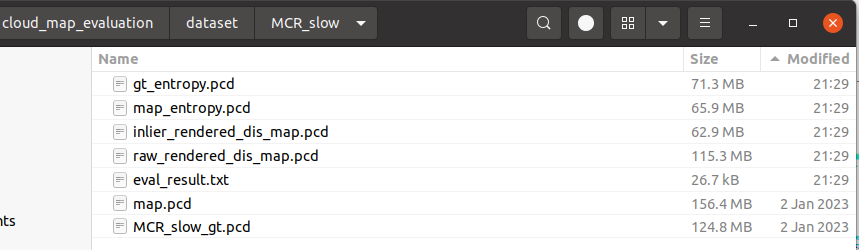

<div align="center">

<h1>MapEval: Towards Unified, Robust and Efficient SLAM Map Evaluation Framework</h1>

[**Xiangcheng Hu**](https://github.com/JokerJohn)<sup>1</sup> · [**Jin Wu**](https://zarathustr.github.io/)<sup>1</sup> · [**Mingkai  Jia**](https://github.com/MKJia)<sup>1</sup>· [**Hongyu  Yan**](https://scholar.google.com/citations?user=TeKnXhkAAAAJ&hl=zh-CN)<sup>1</sup>· [**Yi  Jiang**](https://yijiang1992.github.io/)<sup>2</sup>· [**Binqian  Jiang**](https://github.com/lewisjiang/)<sup>1</sup>
<br>
[**Wei Zhang**](https://ece.hkust.edu.hk/eeweiz)<sup>1</sup> · [**Wei  He**](https://sites.google.com/view/drweihecv/home/)<sup>3</sup> · [**Ping Tan**](https://facultyprofiles.hkust.edu.hk/profiles.php?profile=ping-tan-pingtan#publications)<sup>1*&dagger;</sup>

<sup>1</sup>**HKUST&emsp;&emsp;&emsp;<sup>2</sup>CityU&emsp;&emsp;&emsp;<sup>3</sup>USTB**  
<br>
&dagger;project lead&emsp;*corresponding author

<a href="https://arxiv.org/abs/2411.17928"></a><a ></a>[](https://github.com/JokerJohn/Cloud_Map_Evaluation/stargazers)<a href="https://github.com/JokerJohn/PALoc/network/members">

</a> [](https://github.com/JokerJohn/Cloud_Map_Evaluation/issues)[](https://opensource.org/licenses/MIT)

</div>


MapEval is a comprehensive framework for evaluating point cloud maps in SLAM systems, addressing two fundamentally distinct aspects of map quality assessment:
1. **Global Geometric Accuracy**: Measures the absolute geometric fidelity of the reconstructed map compared to ground truth. This aspect is crucial as SLAM systems often accumulate drift over long trajectories, leading to global deformation.
2. **Local Structural Consistency**: Evaluates the preservation of local geometric features and structural relationships, which is essential for tasks like obstacle avoidance and local planning, even when global accuracy may be compromised.

These complementary aspects require different evaluation approaches, as global drift may exist despite excellent local reconstruction, or conversely, good global alignment might mask local inconsistencies. Our framework provides a unified solution through both traditional metrics and novel evaluation methods based on optimal transport theory.

## Key Features

**Traditional Metrics Implementation**:

- **Accuracy** (AC): Point-level geometric error assessment
- **Completeness** (COM): Map coverage evaluation
- **Chamfer Distance** (CD): Bidirectional point cloud difference
- **Mean Map Entropy** (MME): Information-theoretic local consistency metric

**Novel Proposed Metrics**:

- **Average Wasserstein Distance** (AWD): Robust global geometric accuracy assessment
- **Spatial Consistency Score** (SCS): Enhanced local consistency evaluation

<div align="center">

</div>

## News

- **2024/11/26**: Submitted to a Journal. When the paper accepted, the new version of codes will release! 

## Results

### Simulated experiments

| Noise Sensitivity                                            | Outlier Robustness                                           |
| ------------------------------------------------------------ | ------------------------------------------------------------ |
|  |  |


### Real-world experiments

| Map Evaluation via Localization Accuracy                     | Map Evaluation in Diverse Environments                       |
| ------------------------------------------------------------ | ------------------------------------------------------------ |
|  |  |

|  |
| ------------------------------------------------------------ |
|  |

## Computational Efficiency

|  |
| ------------------------------------------------------------ |

## Parameter Sensitivity Analysis

|  |
| ------------------------------------------------------------ |

## Datasets

### [MS-dataset](https://github.com/JokerJohn/MS-Dataset)

### [FusionPortable (FP) and FusionPortableV2 dataset](https://fusionportable.github.io/dataset/fusionportable_v2/)
### [Newer College (NC)](https://ori-drs.github.io/newer-college-dataset/)

### [ GEODE dataset (GE)](https://github.com/PengYu-Team/GEODE_dataset)

<div align="center">

 </div>

## Quickly Run

### Dependencies

- *[Open3d ( >= 0.11)](https://github.com/isl-org/Open3D)* 

- Eigen3

### Test Data(password: 1)

| sequence                                                     | Test PCD                                                     | GT PCD                                                       |
| ------------------------------------------------------------ | ------------------------------------------------------------ | ------------------------------------------------------------ |
| MCR_slow                                                     | [map.pcd](https://hkustconnect-my.sharepoint.com/:u:/g/personal/xhubd_connect_ust_hk/ES9eSANEr-9NvkFqMzMFsecBo5r3hBpBnj0c6BMPgsfXnQ?e=aijdPf) | [map_gt.pcd](https://hkustconnect-my.sharepoint.com/:u:/g/personal/xhubd_connect_ust_hk/ESfn5EEsiPlCiJcydVc_HqgBDGqy65MHoyu63XE-iKbFBQ?e=dTDon4) |
| [FusionPortable Dataset](https://ram-lab.com/file/site/fusionportable/dataset/fusionportable/#download) |                                                              |                                                              |

### Usage

1. install open3d. (maybe a higer version of CMake is needed)

```bash
git clone https://github.com/isl-org/Open3D.git
cd Open3D && mkdir build && cd build   
cmake ..
make install
```

2. install cloud_map_eval

```bash
git clone https://github.com/JokerJohn/Cloud_Map_Evaluation.git
cd Cloud_Map_Evaluation/cloud_map_eval && mkdir build
cmake ..
make
./cloud_map_eval
```

3. set some params

```c++
double icp_max_distance = 0.5;             // max correspondence pairs distance for  knn search in icp
int method = 2;                            // 0:point-to-point icp 1:point-to-plane icp 
Vector5d accuacy_level = Vector5d::Zero();   // set evaluatation accucay level, eg. 20cm/10cm/5cm/2cm/1cm
accuacy_level << 0.2, 0.1, 0.05, 0.02, 0.01;  //  do not recommand to change this

Eigen::Matrix4d initial_matrix = Eigen::Matrix4d::Identity();   // initial pose for your map

// the path dir must end with '/'
std::string est_path, gt_path, results_path, sequence_name;
std::string est_folder = "/home/xchu/my_git/Cloud_Map_Evaluation/cloud_map_evaluation/dataset/";
sequence_name = "MCR_slow";
est_path = est_folder + sequence_name + "/";
gt_path = est_folder + sequence_name + "/" + sequence_name + "_gt.pcd";
results_path = est_folder + sequence_name + "/";

// in  you want to evaluate mme
bool evaluate_mme = true;
bool evaluate_gt_mme = true;  // for gt map, we do not use it
```

4. get the final results

we have a point cloud map generated by a pose-slam system, and we have a ground truth point cloud map. Then we caculate related metrics.



We can also get a rendered raw distance-error map(10cm) and inlier distance-error map(2cm) in this process, the color R->G->B represent for the distance error at a level of 0-10cm.

.png)

if we do not have gt map, we can evaluate the **Mean Map Entropy (MME)**, smaller means better consistency.

.png)

we can also get a simpe mesh reconstructed from point cloud map.


5. we got the result flies.



### Important Parameters

```c++
bool eva_mesh = false;  // if we construct a simple meth.
bool eva_mme = true; // if we evaluate mme without gt map.

// Downsampling for efficiency
map_3d_ = map_3d_->VoxelDownSample(0.03);
gt_3d_ = gt_3d_->VoxelDownSample(0.03);

double radius = 0.5;  // we choose a nearest distance of 0.5m to caculate the point cov for mme caculation.
mme_est = ComputeMeanMapEntropy(map_3d_, est_entropies, radius);
mme_gt = ComputeMeanMapEntropy(gt_3d_, gt_entropies, radius);


// rendering distance map
// when render the inlier distance map and raw distance map, we choose a thresohold of trunc_dist_[0] (20cm).
map_3d_render_inlier = renderDistanceOnPointCloud(corresponding_cloud_gt, corresponding_cloud_est, param_.trunc_dist_[0]);
map_3d_render_raw = enderDistanceOnPointCloud(gt_3d_, map_3d_, param_.trunc_dist_[0]);
```


## Issues

### How do you get your initial pose?

we can use [CloudCompare](https://github.com/CloudCompare/CloudCompare) to align LIO map to Gt map .

- Roughly  translate and rotate the LIO point cloud map to the GT map。

- Manually register the moved LIO map (aligned) to the GT map (reference), and get the output of the terminal transfrom `T2`, then the initial pose matrix is the terminal output transform `T`.


### What's the difference between raw rendered map and inlier rendered map?

The primary function of the r**aw rendered map** (left) is to color-code the error of all points in the map estimated by the algorithm. For each point in the estimated map that does not find a corresponding point in the **ground truth (gt) map**, it is defaulted to the maximum error (**20cm**), represented as red. On the other hand, the i**nlier rendered map** (right) excludes the non-overlapping regions of the point cloud and colors only the error of the inlier points after point cloud matching. This map therefore contains only a portion of the points from the original estimated map.

.png)


## Publications

We kindly recommend to cite [our paper](https://arxiv.org/abs/2208.11865) if you find this library useful:

```latex
@misc{hu2024mapevalunifiedrobustefficient,
      title={MapEval: Towards Unified, Robust and Efficient SLAM Map Evaluation Framework}, 
      author={Xiangcheng Hu and Jin Wu and Mingkai Jia and Hongyu Yan and Yi Jiang and Binqian Jiang and Wei Zhang and Wei He and Ping Tan},
      year={2024},
      eprint={2411.17928},
      archivePrefix={arXiv},
      primaryClass={cs.RO},
      url={https://arxiv.org/abs/2411.17928}, 
}


@ARTICLE{hu2024paloc,
  author={Hu, Xiangcheng and Zheng, Linwei and Wu, Jin and Geng, Ruoyu and Yu, Yang and Wei, Hexiang and Tang, Xiaoyu and Wang, Lujia and Jiao, Jianhao and Liu, Ming},
  journal={IEEE/ASME Transactions on Mechatronics}, 
  title={PALoc: Advancing SLAM Benchmarking With Prior-Assisted 6-DoF Trajectory Generation and Uncertainty Estimation}, 
  year={2024},
  volume={},
  number={},
  pages={1-12},
  doi={10.1109/TMECH.2024.3362902}
  }

```

## Contributors

<a href="https://github.com/JokerJohn/Cloud_Map_Evaluation/graphs/contributors">
  
</a>
