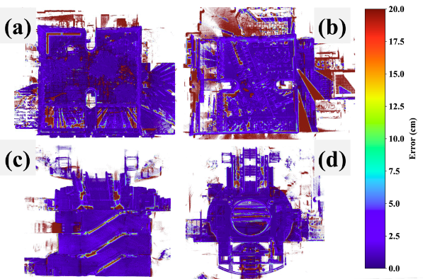

<div align="center">

# MapEval: Towards Unified, Robust and Efficient SLAM Map Evaluation Framework

[**Xiangcheng Hu**](https://github.com/JokerJohn)<sup>1</sup> · [**Jin Wu**](https://zarathustr.github.io/)<sup>1</sup> · [**Mingkai Jia**](https://github.com/MKJia)<sup>1</sup> · [**Hongyu Yan**](https://scholar.google.com/citations?user=TeKnXhkAAAAJ&hl=zh-CN)<sup>1</sup> · [**Yi Jiang**](https://yijiang1992.github.io/)<sup>2</sup> · [**Binqian Jiang**](https://github.com/lewisjiang/)<sup>1</sup>
<br>
[**Wei Zhang**](https://ece.hkust.edu.hk/eeweiz)<sup>1</sup> · [**Wei He**](https://sites.google.com/view/drweihecv/home/)<sup>3</sup> · [**Ping Tan**](https://facultyprofiles.hkust.edu.hk/profiles.php?profile=ping-tan-pingtan#publications)<sup>1*†</sup>

<sup>1</sup>**HKUST** &emsp;&emsp;&emsp; <sup>2</sup>**CityU** &emsp;&emsp;&emsp; <sup>3</sup>**USTB**  
<br>
†Project Lead &emsp; *Corresponding Author

<a href="https://ieeexplore.ieee.org/document/10910156"></a>[](https://github.com/JokerJohn/Cloud_Map_Evaluation/stargazers)<a href="https://github.com/JokerJohn/Cloud_Map_Evaluation/network/members">

</a><a href="https://github.com/JokerJohn/Cloud_Map_Evaluation/pulls">

</a>[](https://github.com/JokerJohn/Cloud_Map_Evaluation/issues)[](https://opensource.org/licenses/MIT)

</div>


## Overview

MapEval is a comprehensive framework for evaluating point cloud maps in SLAM systems, addressing two fundamentally distinct aspects of map quality assessment:

1. **Global Geometric Accuracy**: Measures the absolute geometric fidelity of the reconstructed map compared to ground truth. This aspect is crucial as SLAM systems often accumulate drift over long trajectories, leading to global deformation.

2. **Local Structural Consistency**: Evaluates the preservation of local geometric features and structural relationships, which is essential for tasks like obstacle avoidance and local planning, even when global accuracy may be compromised.

These complementary aspects require different evaluation approaches, as global drift may exist despite excellent local reconstruction, or conversely, good global alignment might mask local inconsistencies. Our framework provides a unified solution through both traditional metrics and novel evaluation methods based on optimal transport theory.

## News

- **2025/07/06:** Use TBB to accelerate MME calculation, update parameter settings and add more configuration examples.
- **2025/05/05:** Add new test data and remove simulation codes.
- **2025/03/05:** [Formally published](https://ieeexplore.ieee.org/document/10910156) in IEEE RAL!
- **2025/02/25:** Paper accepted!
- **2025/02/12:** Source code released! 
- **2025/02/05:** Paper resubmitted.
- **2024/12/19:** Paper submitted to **IEEE RAL**! 

## Key Features

### Traditional Metrics Implementation

- **Accuracy (AC)**: Point-level geometric error assessment
- **Completeness (COM)**: Map coverage evaluation
- **Chamfer Distance (CD)**: Bidirectional point cloud difference
- **Mean Map Entropy (MME)**: Information-theoretic local consistency metric

### Novel Proposed Metrics

- **Average Wasserstein Distance (AWD)**: Robust global geometric accuracy assessment
- **Spatial Consistency Score (SCS)**: Enhanced local consistency evaluation


## Experimental Results

### Simulation Experiments

| Noise Sensitivity                                            | Outlier Robustness                                           |
| ------------------------------------------------------------ | ------------------------------------------------------------ |
|  |  |


### Real-World Experiments

| Map Evaluation via Localization Accuracy                     | Map Evaluation in Diverse Environments                       |
| ------------------------------------------------------------ | ------------------------------------------------------------ |
|  |  |

|  |
| ------------------------------------------------------------ |

### Efficiency and Parameter Analysis

|  |  |
| ------------------------------------------------------------ | ------------------------------------------------------------ |

## Datasets

The following datasets are supported and used for evaluation:

| Dataset | Description |
|---------|-------------|
| [MS-Dataset](https://github.com/JokerJohn/MS-Dataset) | Multi-session mapping dataset |
| [FusionPortable (FP) and FusionPortableV2](https://fusionportable.github.io/dataset/fusionportable_v2/) | Multi-sensor fusion dataset |
| [Newer College (NC)](https://ori-drs.github.io/newer-college-dataset/) | Outdoor autonomous navigation dataset |
| [GEODE Dataset (GE)](https://github.com/PengYu-Team/GEODE_dataset) | Degenerate SLAM dataset |

|  |
| ------------------------------------------------------------ |


## Quick Start

### Dependencies

- [Open3D (>= 0.11)](https://github.com/isl-org/Open3D)
- Eigen3
- yaml-cpp
- TBB (Threading Building Blocks)
- Ubuntu 20.04

### Test Data

Download the test data using password: `1`

| Sequence | Preview | Test PCD | Ground Truth PCD |
|----------|---------|----------|-----------------|
| MCR_slow |  | [map.pcd](https://hkustconnect-my.sharepoint.com/:u:/g/personal/xhubd_connect_ust_hk/ES9eSANEr-9NvkFqMzMFsecBo5r3hBpBnj0c6BMPgsfXnQ?e=aijdPf) | [map_gt.pcd](https://hkustconnect-my.sharepoint.com/:u:/g/personal/xhubd_connect_ust_hk/ESfn5EEsiPlCiJcydVc_HqgBDGqy65MHoyu63XE-iKbFBQ?e=dTDon4) |
| PK01     |  | [map.pcd](https://hkustconnect-my.sharepoint.com/:u:/g/personal/xhubd_connect_ust_hk/ERPFVJN6CtBKtHlPWyni-jIB0dgLzgF1FGxPTatKoCp02Q?e=TEgfBp) | [gt.pcd](https://hkustconnect-my.sharepoint.com/:u:/g/personal/xhubd_connect_ust_hk/EeztnFHwKJlCoW-fmKljaMMBSvNvT5BkTXxoA1iXqeUS5A?e=37evMi) |

### Installation and Usage

#### 1. Install Open3D

Note: A higher version of CMake may be required.

```bash
git clone https://github.com/isl-org/Open3D.git
cd Open3D && mkdir build && cd build   
cmake ..
make install
```

#### 2. Configure Parameters

Set and review the parameters in [config.yaml](map_eval/config/config.yaml):

```yaml
# accuracy_level: vector5d, we mainly use the result of the first element
# For small inlier ratios, try larger values, e.g., for outdoors: [0.5, 0.3, 0.2, 0.1, 0.05]
accuracy_level: [0.2, 0.1, 0.08, 0.05, 0.01]

# initial_matrix: vector16d, the initial transformation matrix for registration
# Ensure correct format to avoid YAML::BadSubscript errors
initial_matrix:
  - [1.0, 0.0, 0.0, 0.0]
  - [0.0, 1.0, 0.0, 0.0]
  - [0.0, 0.0, 1.0, 0.0]
  - [0.0, 0.0, 0.0, 1.0]
  
# vmd_voxel_size: outdoor: 2.0-4.0; indoor: 2.0-3.0
vmd_voxel_size: 3.0
```

#### 3. Compile MapEval

```bash
git clone https://github.com/JokerJohn/Cloud_Map_Evaluation.git
cd Cloud_Map_Evaluation/map_eval && mkdir build && cd build
cmake ..
make
```

#### 4. Run Evaluation

```bash
./map_eval
```

This evaluates a point cloud map generated by a SLAM system against a ground truth point cloud map and calculates related metrics.


### Visualization

#### Error Visualization

The framework generates rendered distance-error maps with color coding:
- **Raw distance-error map (10cm)**: Shows error for all points
- **Inlier distance-error map (2cm)**: Shows error for matched points only
- **Color scheme**: R→G→B represents distance error levels from 0-10cm

.png)

#### Evaluation Without Ground Truth

If ground truth is not available, only **Mean Map Entropy (MME)** can be evaluated. Lower values indicate better consistency. Set `evaluate_mme: false` in [config.yaml](map_eval/config/config.yaml).

.png)

#### Mesh Reconstruction

A simple mesh can be reconstructed from the point cloud map:


#### 5. Output Files

The evaluation generates the following result files:


#### 6. Voxel Error Visualization

For detailed voxel error visualization, use [error-visualization.py](map_eval/scripts/error-visualization.py):

```bash
pip install numpy matplotlib scipy
python3 error-visualization.py
```

|  |  |
|-------------------------------------------------------|-------------------------------------------------------|
|  |  |

## Frequently Asked Questions

### How to Obtain Initial Pose?

Use [CloudCompare](https://github.com/CloudCompare/CloudCompare) to align the LiDAR-Inertial Odometry (LIO) map to the ground truth map:

1. Roughly translate and rotate the LIO point cloud map to align with the GT map
2. Manually register the moved LIO map (aligned) to the GT map (reference)
3. Extract the terminal transform output `T` as the initial pose matrix

|  |  |
|----------------------------------------------------------------|----------------------------------------------------------------|

### Difference Between Raw and Inlier Rendered Maps

- **Raw rendered map** (left): Color-codes error for all points in the estimated map. Points without correspondences in the ground truth map are assigned maximum error (20cm) and rendered in red.

- **Inlier rendered map** (right): Excludes non-overlapping regions and colors only inlier points after point cloud matching. Contains only a subset of the original estimated map points.

*Credit: [John-Henawy](https://github.com/John-Henawy) in [issue #5](https://github.com/JokerJohn/Cloud_Map_Evaluation/issues/5)*

.png)

### Applicable Scenarios

#### 1. With Ground Truth Map
All metrics (AC, COM, CD, MME, AWD, SCS) are applicable.

#### 2. Without Ground Truth Map
Only **Mean Map Entropy (MME)** can be used for evaluation. 

**Important considerations:**
- Maps must be on the same scale
  - Cannot compare LIO maps with LIO SLAM maps that have undergone loop closure optimization. Loop closure modifies local point cloud structure, leading to inaccurate MME evaluation.
  - Can compare MME between different LIO maps

*Credit: [@Silentbarber](https://github.com/Silentbarber), [ZOUYIyi](https://github.com/ZOUYIyi) in [issue #4](https://github.com/JokerJohn/Cloud_Map_Evaluation/issues/4) and [issue #7](https://github.com/JokerJohn/Cloud_Map_Evaluation/issues/7)*

## Citation

If you find this work useful for your research, please cite our paper:

```bibtex
@article{hu2025mapeval,
  title={MapEval: Towards Unified, Robust and Efficient SLAM Map Evaluation Framework}, 
  author={Xiangcheng Hu and Jin Wu and Mingkai Jia and Hongyu Yan and Yi Jiang and Binqian Jiang and Wei Zhang and Wei He and Ping Tan},
  journal={IEEE Robotics and Automation Letters},
  year={2025},
  volume={10},
  number={5},
  pages={4228-4235},
  doi={10.1109/LRA.2025.3548441}
}

@article{wei2024fpv2,
  title={Fusionportablev2: A unified multi-sensor dataset for generalized slam across diverse platforms and scalable environments},
  author={Wei, Hexiang and Jiao, Jianhao and Hu, Xiangcheng and Yu, Jingwen and Xie, Xupeng and Wu, Jin and Zhu, Yilong and Liu, Yuxuan and Wang, Lujia and Liu, Ming},
  journal={The International Journal of Robotics Research},
  pages={02783649241303525},
  year={2024},
  publisher={SAGE Publications Sage UK: London, England}
}
```

## Related Works

The following research works have utilized MapEval for map evaluation:

| Work | Description | Publication | Metrics Used | Preview |
|------|-------------|-------------|--------------|---------|
| [**LEMON-Mapping**](https://arxiv.org/abs/2505.10018) | Multi-Session Point Cloud Mapping | arXiv 2025 | MME |  |
| [**CompSLAM**](https://arxiv.org/abs/2505.06483) | Multi-Modal Localization and Mapping | arXiv 2025 | AWD/SCS |  |
| [**GEODE**](https://github.com/PengYu-Team/GEODE_dataset) | SLAM Dataset | IJRR 2025 | - |  |
| [**ELite**](https://github.com/dongjae0107/ELite) | LiDAR-based Lifelong Mapping | ICRA 2025 | AC/CD |  |
| [**PALoc**](https://github.com/JokerJohn/PALoc) | Prior-Assisted 6-DoF Localization | T-MECH 2024 | AC/CD |  |
| [**MS-Mapping**](https://github.com/JokerJohn/MS-Mapping) | Multi-Session LiDAR Mapping | arXiv 2024 | AC/CD/MME |  |
| [**FusionPortableV2**](https://journals.sagepub.com/doi/full/10.1177/02783649241303525) | SLAM Dataset | IJRR 2024 | COM/CD |  |


## Contributors

We thank all contributors to this project:

<a href="https://github.com/JokerJohn/Cloud_Map_Evaluation/graphs/contributors">
  
</a>

## Star History

[](https://star-history.com/#JokerJohn/Cloud_Map_Evaluation&Date)

## License

This project is licensed under the MIT License - see the [LICENSE](LICENSE) file for details.
